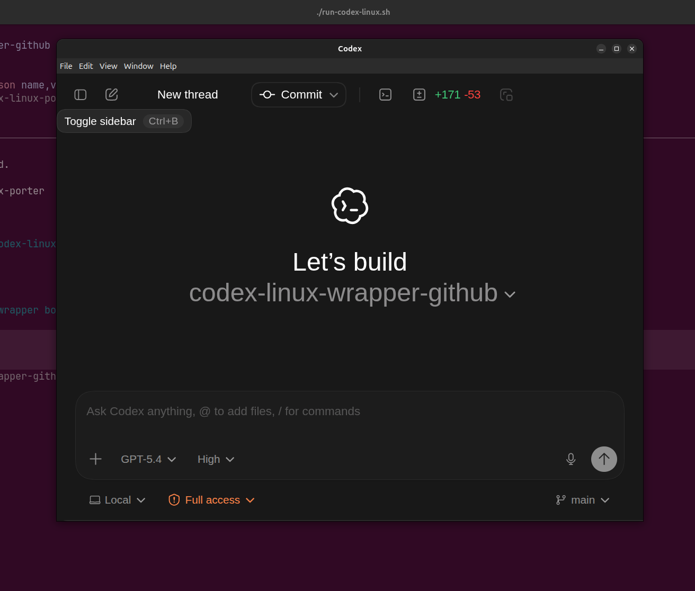

# Codex Linux Porter (Ubuntu/Linux)

> [!IMPORTANT]
> This is an unofficial community project for running the macOS Codex app on Linux.
> It is not affiliated with, endorsed by, or supported by OpenAI.
> Treat it as a temporary bridge until an official Linux app exists.

This project ports the macOS Codex Electron app to Linux by reusing the app payload from the DMG, rebuilding the platform-specific pieces, and launching it with a Linux Electron runtime. It is an unofficial compatibility layer, not an official OpenAI Linux app.





## What this porter does

- Extracts the Codex `.dmg` file.
- Pulls `Codex.app/Contents/Resources/app.asar` from the DMG.
- Reinstalls and rebuilds Linux-compatible native modules (`better-sqlite3`, `node-pty`) for the bundled Electron version.
- Launches the unpacked Electron app payload with Linux-compatible `electron`.

The UI is still the official Codex app; only the runtime host changes.

## Status and support

This project is a temporary Linux workaround for people who want to use Codex before there is an official Linux desktop app.

- This is not an OpenAI product.
- OpenAI does not provide support for this porter.
- Breakage is possible when Codex changes its packaged app structure or native modules.
- You should expect to re-run bootstrap steps when a new DMG is released.
- If an official Linux app becomes available, that should be preferred over this project.

## Folder layout

- `<REPO_ROOT>/work` **(important)**: all generated/working artifacts.
  - `dmg/` → copied DMG.
  - `app.asar` → extracted app bundle from `app.asar`.
  - `app/` → unpacked asar app source used by Electron.
  - `extracted_dmg/` → temporary extract tree from 7z.
  - `payload/info`, `.cache/`, `.electron-npx-cache/`, and `native-rebuild/` helper folders.
- `setup/*.sh` → bootstrap + setup pipeline scripts.
- `run-codex-linux.sh` → runtime launcher.

If you need a full reset, deleting this directory and rerunning setup is safe:

```bash
REPO_ROOT="$(pwd)"  # directory where you cloned this repo
rm -rf "$REPO_ROOT/work"
```

## DMG structure and why this works

A `.dmg` is basically a disk image container. In this app it contains the classic macOS app bundle:

- `Codex Installer/Codex.app/Contents/Resources/app.asar`
- `.../Codex.app/Contents/Resources/app.asar.unpacked` (optional)
- `.../Codex.app/Contents/Frameworks/...` etc.

`app.asar` is Electron’s archive format (`asar`) for app code/assets. We extract it and point Electron at the unpacked directory.

Flow:

1. `setup/01_download_or_link_dmg.sh` copies/gets `Codex.dmg`.
2. `setup/02_extract_codex.sh` extracts it with `7z` and copies `app.asar`.
3. `setup/03_unpack_asar.sh` unpacks `app.asar` into `work/app`.
4. `setup/04_fix_native_modules.sh` stages fresh module installs and builds Linux native addons for the app's Electron ABI.
5. `setup/06_patch_sidebar_fallback.sh` applies the Linux render fixes and patches the hidden-window startup path in the extracted main bundle.
6. `setup/05_verify_stack.sh` checks Electron/CLI/native compatibility.
7. `run-codex-linux.sh` launches `electron` on `work/app`.

### Why this can work without rebuilding everything

- The app shell and web UI are JavaScript/HTML/CSS and can run on Electron across platforms.
- `asar` is just Electron’s packaging format; extracting and running payload content is expected.
- Only native add-ons differ by platform/ABI, so Linux rebuilds them and validates ELF binaries.

## How it launches and talks to CLI

`run-codex-linux.sh` sets `CODEX_CLI_PATH` and then execs Electron:

- `--` command uses your installed `electron` binary when available.
- If missing, it falls back to `npx electron@<version>`.
- On Linux, the fallback launcher uses `--no-sandbox` by default because the downloaded Electron runtime does not ship with a working setuid sandbox helper on typical user systems.
- Electron is pointed at `work/app` (unpacked payload).
- The launcher exports `BUILD_FLAVOR` and `CODEX_BUILD_NUMBER` from the unpacked app metadata so the packaged runtime checks succeed.

Inside the app, one startup path starts the app backend using the CLI command:

- `bash -lc "codex app-server"`

So the porter relies on the **same `codex` CLI binary you already use on Linux**.

### Sandbox note

There are two separate sandbox layers here:

- Electron sandbox: the porter's Linux fallback currently disables Chromium's sandbox with `--no-sandbox`.
- Codex agent command sandbox: the app backend still runs through `codex app-server`, which uses your normal Codex CLI config from `~/.codex/config.toml` for agent behavior and approvals.

That means this porter is less isolated than `codex --full-auto`, but it is not the same as launching the Codex agent with `--dangerously-bypass-approvals-and-sandbox`.

## Login: GPT login (no API key)

This porter does not require API keys.

Use this once:

```bash
codex login
```

That flow stores interactive auth state in the CLI user config. After that, the porter’s embedded app-server uses the CLI’s auth context automatically.

Useful checks:

```bash
codex login status
codex --help | head -n 1
```

If you still want key-based auth, CLI also supports `codex login --with-api-key`, but this porter’s intended local workflow is GPT/dev account login.

## Can I change the UX?

Short answer: yes, but with caveats.

What is safe/low risk:

- Frontend tweaks in extracted assets under `work/app/webview`.
- Replace static assets/icons/styles and restart app.

What is risky:

- Editing minified runtime code directly (`work/app/.vite/build/*.js`) can be fragile.
- Native bridge IPC assumptions and packaged assumptions can break quickly.
- Any mismatch in asset paths or preload contracts can crash startup.

Recommended path for real UX changes:

1. Patch Codex source in upstream repo.
2. Build Linux-compatible app bundle there (or re-create the porter from your own built payload).
3. Re-import into the porter flow.

## Will updates work?

Not in the automatic way.

The app’s built-in updater is configured through Sparkle and only starts on macOS production builds:

- `shouldIncludeSparkle` returns true only for macOS in non-dev build flavors.
- This Linux porter path runs as an unpacked app dir with no Sparkle runtime on Linux.

Result: “Check for Updates” is effectively a no-op / unavailable under the Linux porter.

If OpenAI changes the macOS app packaging, startup flow, or native modules, this porter may need updates before it works again.

For updates:

1. Download a new Codex DMG.
2. Re-run:

```bash
./setup/bootstrap.sh /path/to/new/Codex.dmg
```

The porter is re-primed with the new payload.

## Commands

Full bootstrap:

```bash
cd /path/to/codex-linux-porter
./setup/bootstrap.sh /path/to/Codex.dmg
codex login
./run-codex-linux.sh
```

Optional env overrides:

- `CODEX_DMG_PATH` or `CODEX_DMG_URL`
- `WORK_DIR` (defaults to `<repo>/work`)
- `APP_DIR` and `APP_ASAR_PATH`
- `ELECTRON_BIN`
- `CODEX_CLI_PATH`
- `ELECTRON_DISABLE_SANDBOX=1` (default for the Linux fallback launcher)
- `ELECTRON_CACHE_DIR` and `ELECTRON_XDG_CACHE_DIR`

Verification:

```bash
./setup/05_verify_stack.sh
```
